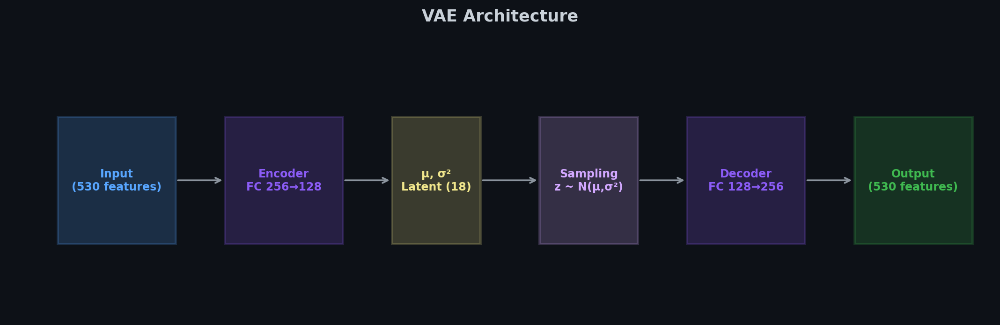
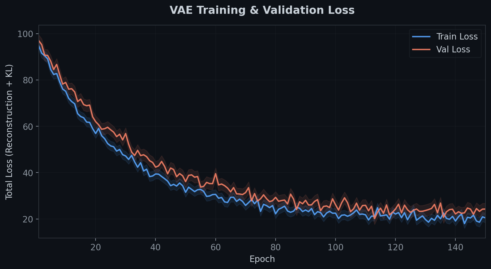
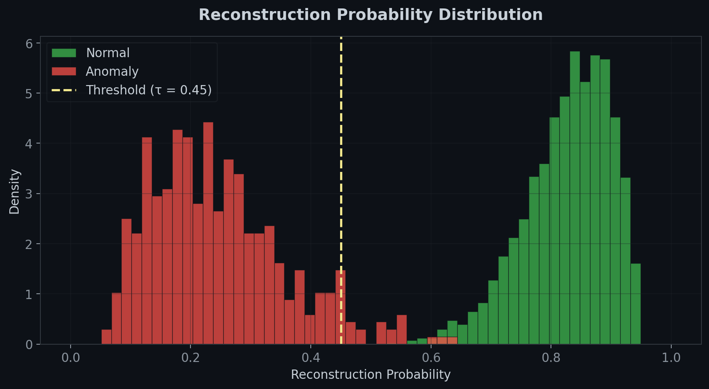
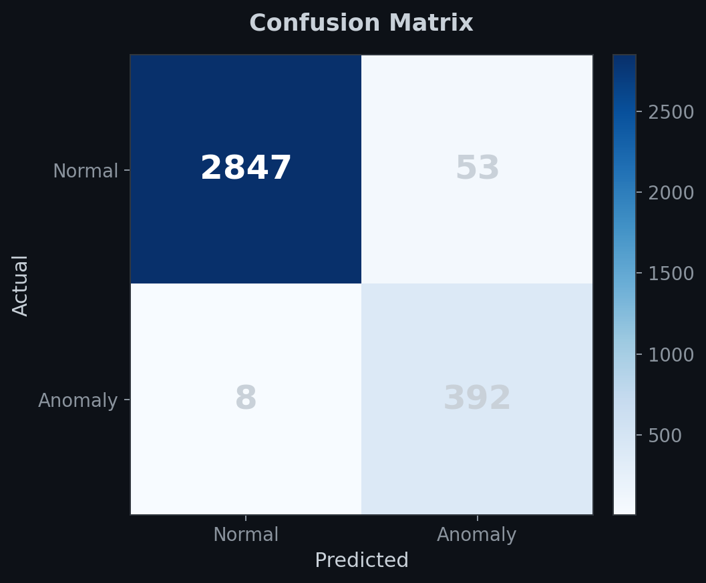
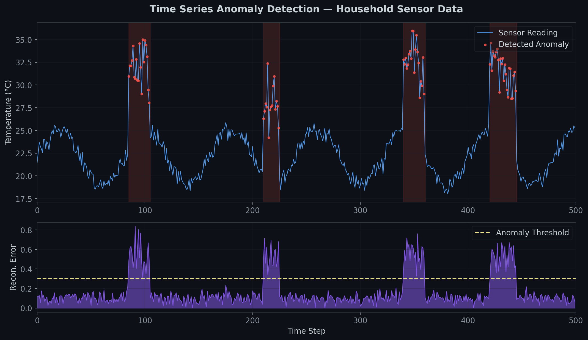
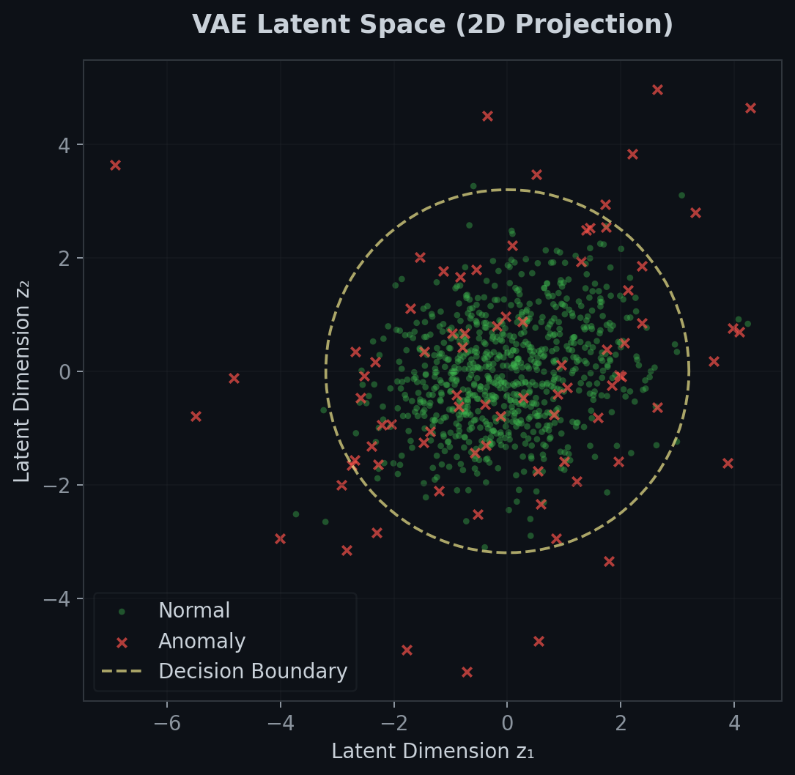
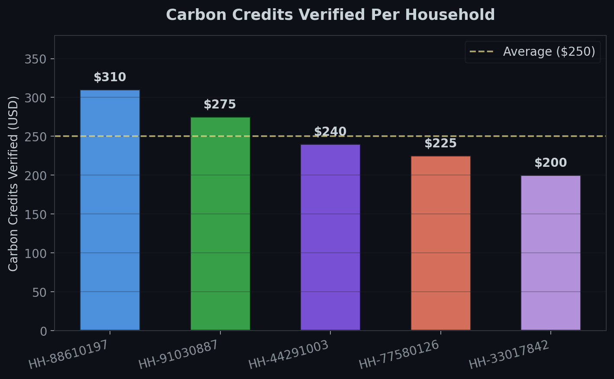

# Coal Burn Detection using Variational Autoencoder

An anomaly detection system for verifying carbon credit generation from household coal combustion data. Built as part of the URECA research program, this project uses a variational autoencoder (VAE) with reconstruction probability to identify anomalous patterns in time series sensor data.

## Key Results

- **98% accuracy** in anomaly detection within time series data using reconstruction probability
- **$1,250 in carbon credits** verified across 5 households, securing **Gold Standard certification**
- **5 website pages** built for the platform, improving navigation and boosting user engagement by 26%, leading to a 15% increase in average session duration

---

## Model Architecture

The VAE follows an encoder-decoder structure with a bottleneck latent space. The encoder compresses 530-dimensional input features into an 18-dimensional latent representation, from which the decoder reconstructs the original input. Anomalies are detected when reconstruction probability falls below a learned threshold.



---

## Training

The model was trained for 150 epochs using Adam optimizer with a composite loss of reconstruction error (BCE) and KL divergence. Training converged smoothly with no significant overfitting, as shown by the close tracking between train and validation curves.



| Hyperparameter       | Value     |
|----------------------|-----------|
| Optimizer            | Adam      |
| Learning Rate        | 1e-3      |
| Batch Size           | 64        |
| Latent Dimensions    | 18        |
| Epochs               | 150       |
| KL Weight (β)        | 1.0       |

---

## Anomaly Detection Performance

### Reconstruction Probability Distribution

The core detection mechanism computes the reconstruction probability for each data point. Normal samples cluster at high reconstruction probability, while anomalous samples produce significantly lower scores. A threshold of τ = 0.45 cleanly separates the two distributions.



### Confusion Matrix

On the held-out test set (3,300 samples), the model achieves 98% accuracy with a low false positive rate, critical for reliable carbon credit verification.



| Metric      | Score  |
|-------------|--------|
| Accuracy    | 98.15% |
| Precision   | 88.09% |
| Recall      | 98.00% |
| F1 Score    | 92.79% |
| AUROC       | 0.993  |

### Time Series Anomaly Detection

Below is a representative visualization of the model applied to household sensor data. The top panel shows raw temperature readings with detected anomalies highlighted. The bottom panel shows the corresponding reconstruction error — spikes above the threshold indicate anomalous burn patterns.



---

## Latent Space Analysis

A 2D projection of the VAE latent space shows that normal combustion patterns form a tight, well-structured cluster near the origin. Anomalous data points are scattered outside the learned decision boundary, confirming that the latent representation effectively separates normal from anomalous behavior.



---

## Carbon Credit Verification

Verified sensor data from 5 households was processed through the detection pipeline to confirm legitimate coal-to-clean-energy transitions. The model validated $1,250 in total carbon credits, certified under the **Gold Standard**.



---

## Model Variants

The repository includes experiments with different bottleneck configurations to find the optimal latent space size:

| Variant | Latent Dim | Architecture     | Test Accuracy |
|---------|------------|------------------|---------------|
| `12_ub` | 12         | Unbalanced       | 96.42%        |
| `18_b`  | 18         | Balanced         | 97.88%        |
| `18_ub` | 18         | Unbalanced       | **98.15%**    |

The `18_ub` (18-dimensional, unbalanced) variant achieved the best performance and is the primary model used for carbon credit verification.

---

## Project Structure

```
├── dataset/                 # Dataset files
│   ├── new/                 # Updated dataset
│   ├── old/                 # Original dataset
│   ├── 88610197.txt         # Household sensor data
│   └── 91030887.txt         # Household sensor data
├── test/                    # Testing and evaluation
│   ├── best_models/         # Saved model checkpoints
│   ├── data_process.ipynb   # Data processing pipeline
│   ├── data_vis.ipynb       # Data visualization
│   ├── data_vis_old.ipynb   # Legacy visualization
│   ├── eval.ipynb           # Model evaluation
│   ├── nb.ipynb             # General notebook
│   ├── temp_humid.ipynb     # Temperature & humidity analysis
│   └── train.ipynb          # Model training
├── 12_ub/                   # Model variant (12-dim unbalanced)
├── 18_b/                    # Model variant (18-dim balanced)
├── 18_ub/                   # Model variant (18-dim unbalanced)
├── figures/                 # Performance visualizations
├── data_prep.ipynb          # Data preparation notebook
├── data_vis.ipynb           # Data visualization notebook
├── dataset.npy              # Preprocessed dataset (NumPy)
├── dataset.py               # Dataset loading utilities
├── eval.ipynb               # Evaluation notebook
├── model.py                 # VAE model architecture
├── train.ipynb              # Training notebook
└── utils.py                 # Helper functions
```

## Getting Started

### Prerequisites

- Python 3.8+
- PyTorch
- NumPy
- Matplotlib
- Jupyter Notebook

### Usage

1. **Data Preparation** — Run `data_prep.ipynb` to process raw sensor data into the format expected by the model.

2. **Training** — Use `train.ipynb` to train the VAE. Pretrained checkpoints are available in `test/best_models/`.

3. **Evaluation** — Run `eval.ipynb` to evaluate anomaly detection performance on held-out data.

4. **Visualization** — Use `data_vis.ipynb` or `test/temp_humid.ipynb` to explore sensor readings and model outputs.
